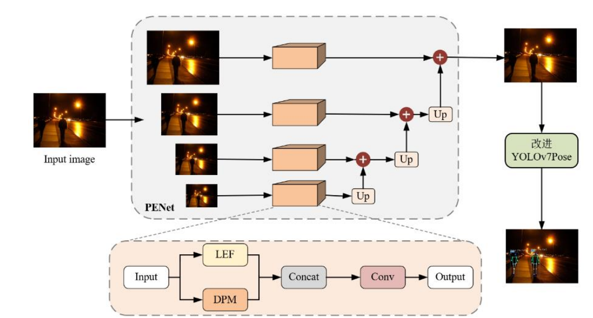

⚠ Warning: This paper is under review, may not reprint any content!!!
Relevant code to be uploaded later
# PESTA：Real-time Video Fall Detection Based on Human Pose Estimation and Skeletal State Analysis

## Introduction
Here is the paper we will publish "Real-time Video Fall Detection Based on Human Pose Estimation and Skeletal State Analysis". 

Here's how we improved the specific network structure of YOLOv7Pose

## Fall Detection Demo
Below is a video example of our method being tested on a fall detection dataset. These include various poses such as sitting, squatting, bending and walking. It also includes side, forward, backward falls and no fall cases.

